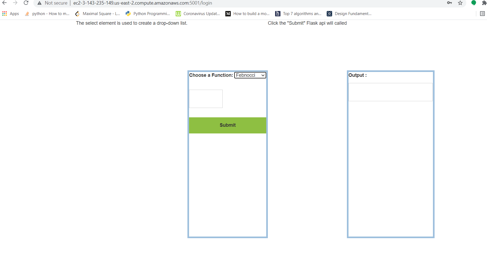

# Reffrence doc
<!-- TOC depthFrom:1 depthTo:2 withLinks:1 updateOnSave:1 orderedList:0 -->

- [Reffrence doc](#Reffrence-doc)
    - [Preamble](#preamble)
    - [Febnocci](#fibnocci)
    - [Factorial](#factorial)	
    - [Auckerman](#auckerman)	
    - [Web interphase](#webinterphase)	
    - [API Monitoring](#apimonitoring)
    - [Local set up](#localsetup])		
<!-- /TOC -->

## Preamble
This documentation helps us to understand the details of rest apis. This is for Febnocci api, Auckerman function API, and factorial api.

This also describes the monotoring this api's perfomance using monitoring dashboard.

This helps to how use the web interphase , which i developed, will help to calculate auckerman, fibnocci and factorial functions.

Also helps to set up and run this application locally in a linux or windows machine

## Febnocci
end_point			:hostname:5001/feb

Mandotory Parameter	:n (number greater than zero)

calling from python	: 

import requests
response = requests.get(url='hostname/feb',params={'n':5})
print(response.json())
print(response.status_code)

Sample reponse success:

{'Message': 'Success', 'input': '6', 'ouput': 8}

Reponse code:200

Calling from browser:

http://ec2-3-143-235-149.us-east-2.compute.amazonaws.com:5001/feb?n=7

Sample reponse error:

{'Message': "Error due to invalid literal for int() with base 10: 'ad'", 'input': 'ad'}

Reponse code:400
### Implementation logic

The Fibonacci numbers are the numbers in the below sequence.
0, 1, 1, 2, 3, 5, 8,....
it is defined by below relation shit
f(n)=f(n-1) + f(n-2)
with seed values 
f(0) = 0 and f(1) = 1.

complexity of O(n)
space complexity:O(n)
simple method is directly calling the funtions recursivily. to improve the perfomance decided dynamic programming approach, which will avoid duplicate calculation.

##Factorial

end_point			:hostname:5001/fac

Mandotory Parameter	:n (number greater than or equal to zero)

calling from python	: 

import requests
response = requests.get(url='hostname/fac',params={'n':5})
print(response.json())
print(response.status_code)

Calling from browser:

http://ec2-3-143-235-149.us-east-2.compute.amazonaws.com:5001/fac?n=7

Sample reponse success:
{'Message': 'Success', 'input': '5', 'ouput': 120}
200

Sample reponse error:
{'Message': "Error due to invalid literal for int() with base 10: 'ad'", 'input': 'ad'}
Reponse code:400

### Implementation logic
	Factorial of a number , is multiplication of all integers smaller than or equal to n. For example factorial
	n!= n * n-1 * n-2 *...* 1
	5!=5*4*3*2*1=120
	Below is the implementation.
	complexity of O(n)
	space complexity:O(1)
	
	def factorial(n):
		if n < 0:
			return 0
		elif n == 0 or n == 1:
			return 1
		else:
			fact = 1
			while(n > 1):
				fact *= n
				n -= 1
			return fact

##Auckerman

end_point			:hostname:5001/ack

Mandotory Parameter	:n (number greater than or equal to zero), m (number greater than or equal to zero)

calling from python	: 

import requests
response = requests.get(url='hostname/fac',params={'n':1,'m':1})
print(response.json())
print(response.status_code)

Calling from browser:

http://ec2-3-143-235-149.us-east-2.compute.amazonaws.com:5001/ack?n=7&m=3

Sample reponse success:

{'Message': 'Success', 'input': {'m': 1, 'n': 1}, 'ouput': 3}
200
Sample reponse error:

{'Message': "Error due to invalid literal for int() with base 10: 'ad'", 'input': : {'m': 'ad', 'n': 1}}
Reponse code:400

### Implementation logic

A(m,n)=n+1 if m==0
A(m,n)=A(m-1, 1) if n==0
A(m,n)=A(m-1, A(m, n-1)) for i, j > 0

Used recururve calculation to solve the proble. Due to the memory and computational contraints, 

we have defined boundry values up to which we can calculate value.

the values we get are too huge like m to the power m m times. with our minimal compution engines , we had define boundries.

"n<0 or m < 0"  and "m==3 and n > 13) or (m==4 and n > 1) or (m==5 and n>0) or (m>5)"

we have class called aukcer man. and couple of class variable to store caches , to avoid duplicate computation.

cache = {} will hold the value of dict of dicts.

iteratively call the auckerman calculator and result is stored in the cache. 

If result not found in cache , then only iterative call happens.

## Web interphase

I have built a web interphase for this project.

login screen:

http://ec2-3-143-235-149.us-east-2.compute.amazonaws.com:5001/login

User can log in to the web interphase and select the funtion and see the result. The ui is ver basic and simple implementation. We can definetely improve. 

But just showing here as a proof of concept. The images where happen , when this was deployed in am aws machine.

user name and password is admin/admin123

Login Screen:

Function selection Screen:

Function output Screen:

## API Monitoring
I haved used "Flask Monitoring Dashboard" to monitor the perfomance of the application. 

We can monitor following attributes.

Monitor the performance and utilization

Profile requests and endpoints

Collect extra information about outliers

Collect additional information about your Flask-application

url to use after starting the app:

http://ec2-18-118-12-238.us-east-2.compute.amazonaws.com:5001/dashboard/overview

or 

hostname:port/dashboard/overview

login id: admin/admin

below are few images for reffrence.

## Local set up

If docker is installed and running in the machine, it is just 3 step process to start.

Start the docker:

sudo systemctl start docker

build the image:

sudo docker build --tag calc-app .

run the image:

sudo docker run --name calc-app -p 5001:5001 calc-app

